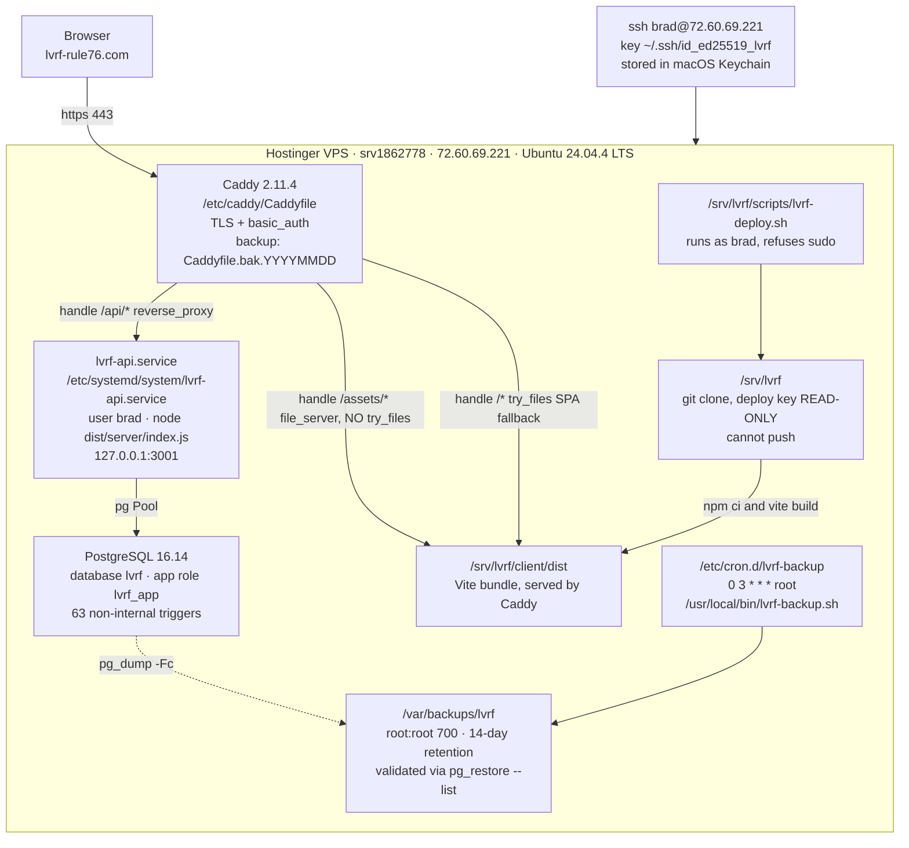
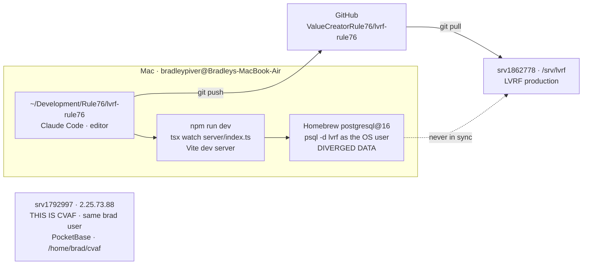
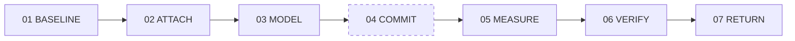
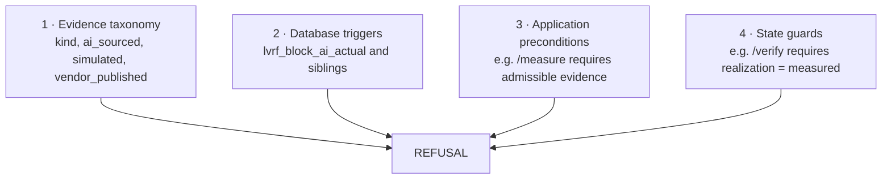
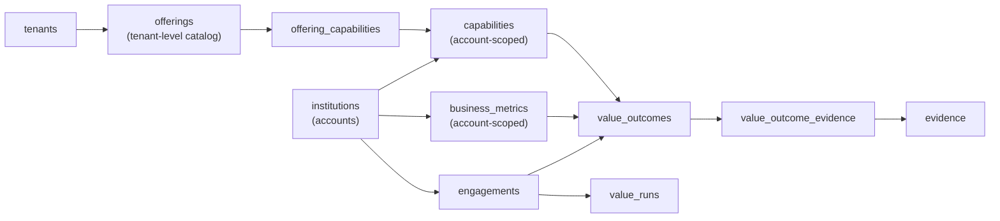

# LVRF — Design & Handover Specification

**Learning Value Realization Framework · Studio**
A Rule 76 Studio, running on Compass OS.

Version of record: 26 August 2026
Production HEAD at time of writing: see `git log -1` on `srv1862778:/srv/lvrf`

---

## 0. How to use this document

You are a Claude session picking up development of LVRF. Read this file first, then
`BUILD_STATUS.md` in the same repository. This file describes the system's **shape**;
`BUILD_STATUS.md` is the **chronological record** of what was built, what was found,
and what was corrected.

Three rules govern how you should work on this codebase. They are not style
preferences — they were each learned by something breaking.

1. **Verify, don't infer.** Every claim about the running system must be checked
   against the running system. A count that reconciles is not proof the right things
   are present. Compare lists, not totals.
2. **A push that isn't deployed is not a fix.** And a commit that isn't pushed isn't
   a change. Both have cost real time on this project.
3. **Never fabricate a value to satisfy a schema.** If a field has no honest value,
   the correct answer is null, an explicit absence state, or a refusal — never a
   plausible default.

### What this document cannot tell you

The author of this file has never read the following and they are authoritative
where they conflict with anything here:

- `CLAUDE.md` in the repository root (~217 lines, trimmed by hand against a stated
  adherence threshold)
- `db/HEALTH_MODEL.md`, `db/CONFIDENCE_MODEL.md`, `db/DELTA_AND_PROVENANCE.md` —
  each named in code comments as the canonical spec for its model
- `db/BRAND.md`
- The Rule 76 Constitution and its Amendments, held in the `rule76-cathedral`
  repository. AMENDMENT-003 (health model), AMENDMENT-004 (contrast and palette)
  and AMENDMENT-005 Article I (AI-sourced evidence) are cited in code but their
  full texts are not reproduced here
- `COMPASS-HEARTBEAT-STATUS §7`, cited by `healthModel.ts`

Read those before making a decision they might govern.

---


---

## 0b. Working context — read this before doing anything

§0 tells you what to read. This tells you how work actually happens on this
project. It exists because sessions kept re-deriving it: one searched the entire
filesystem for a file whose path is below, another asked whether pushing to `main`
was acceptable.

### Where things are

```
Repo (Mac)        ~/Development/Rule76/lvrf-rule76
Production box    brad@72.60.69.221   /srv/lvrf   host srv1862778
GitHub            github.com:ValueCreatorRule76/lvrf-rule76
Live site         https://lvrf-rule76.com   (Caddy basic_auth)
```

**A different VPS, `srv1792997`, runs CVAF.** Same `brad` user, IP one digit
different. Commands intended for one have landed on the other more than once. **Read
the shell prompt before every paste.**

### You cannot reach the VPS

Claude Code runs on the Mac. Every deploy and every production query is run **by
hand over SSH** by Brad, who pastes the output back.

**Give commands to run. Never report that you have verified something on
production.** Sessions have claimed production verification they could not have
performed; the correct behaviour is to say which claims you can attest to and which
you cannot.

### The loop

```
Claude Code edits and commits on the Mac
Brad pushes
Brad, on the box:  cd /srv/lvrf && ./scripts/lvrf-deploy.sh
```

**Push straight to `main`.** One developer, one branch, and the deploy script pulls
from `main`. A PR to yourself adds a step and no review. Do not ask.

**A push that isn't deployed is not a fix**, and a commit that isn't pushed isn't a
change. Both have cost real time. The deploy script's HEAD comparison catches the
second — if `old HEAD` and `new HEAD` match, nothing was pulled.

### Commands that differ by machine

```
Mac        psql -d lvrf                     works — OS user
Box        sudo -u postgres psql -d lvrf    required — there is no brad role
```

`psql -d lvrf` on the box fails with `role "brad" does not exist`, which reads like
a configuration fault and is actually being on the wrong machine.

```
Deploy      cd /srv/lvrf && ./scripts/lvrf-deploy.sh
Migrate     npx drizzle-kit migrate            (from /srv/lvrf)
Hardening   sudo -u postgres psql -d lvrf -f db/hardening.sql
Backup      sudo /usr/local/bin/lvrf-backup.sh
```

**Backup before any schema change.** Order is always: backup → migrate → hardening
→ test.

### The component library — do not invent a second one

Any new UI uses these. A session that builds its own form language creates a second
visual system nobody maintains.

```
GovernedForm     the form primitive: provenance block first, four result
                 treatments, actor gating, disabled fieldset
GovernedAction   a governed write with no input to collect
ResultBlock      the four result states, shared by both
Card, Badge      the container idiom, seven badge tones
FOCUS_RING       the shared focus treatment, gold on ink
ActorContext     useActor(); session-scoped, React state only
postGoverned     the only write helper; returns a four-state union
```

**Four result states, four treatments.** `refused` (422) and `conflict` (409) get
the ink block with the server's message **verbatim**. `error` is muted and
deliberately quieter. **A governance refusal is the system working; a 500 is the
system failing.** Rendering both the same undoes the argument the database enforces.

**Ink is reserved for refusals and conflicts.** Preconditions use the gold
left-border callout.

### Local and production are not the same, permanently

Local carries seed data, `customer_b` fixtures and test rows; production was rebuilt
from migrations. Governance forbids hard deletes, so local junk persists.

**Local has also been found several migrations behind while the journal claimed
otherwise** — `drizzle-kit migrate` skips a migration it believes is applied, so the
drift is permanent until someone checks `information_schema` directly. Resolved on
30 August; check parity before attributing a failure to new code.

Some paths are **only testable on production** — local has 14 outcomes per
engagement where production has one, so `produceRun`'s single-outcome guard blocks
locally.

> A clean local render proves nothing about production. Verify against production or
> say that you didn't.

### How to work here

**Report what you cannot verify.** Sessions that flagged "I have no record of
connecting to production" were right to, every time. A claim you can check against
your own work is different from one relayed to you.

**Stop when a spec conflicts with itself.** More than one instruction has been
contradictory — a rename that broke a file marked do-not-touch, a three-state design
that should have been two axes. **Flagging beat guessing every time.**

**Read the code before writing to it.** Confirm a field exists before rendering it;
confirm a column exists before selecting it. Types written from a description rather
than from the server is the defect this client produced seven times.

**A large diff for a small change needs proof, not explanation.** A full-file
reorder defeats `git diff`. Sort both versions and compare — thirty seconds converts
a reasoned claim into a checked one.

**Never fabricate a value to satisfy a schema.** Null, an explicit absence state, or
a refusal. Never a plausible default — and a default in a shared interface is an
assertion made on behalf of every caller.

## 1. Mission and premise

LVRF records what a learning investment was expected to change, what it actually
changed, and **how well that is known** — and refuses to publish what the evidence
cannot carry.

*(This wording was drafted from observed system behaviour, not taken from a
canonical source. If the Cathedral holds an official mission statement, it
supersedes this.)*

### The two axes

The single most important conceptual distinction in the system. Collapsing these
two caused a significant design error that had to be unwound:

| Axis | Question | Expressed as |
|---|---|---|
| **Realization** | Did the value happen? | `realization_status`: claimed → measured → verified, or not_realized |
| **Evidence** | How well do we know? | `confidence_score` 0–100, computed from the evidence ledger |

An **Outside-In value hypothesis** is `realization = 'claimed'` with `confidence =
low`. That is a **complete, lockable, defensible state** — not a failed attempt at
`measured`. Movement along the evidence axis while realization stays put is the
core product motion: lock a hypothesis, validate it with the customer, relock, and
the delta is *how much more of this can now be defended*.

---

## 2. Rule 76 standards

These are the constitutional principles as they appear in the code. The Cathedral
holds the authoritative texts.

### Truth and provenance

Every figure carries its origin. There is **no single `data_class` column** —
provenance is carried by a set of fields, and this document previously claimed
otherwise (see §18). What actually exists:

| Field | Table | Carries |
|---|---|---|
| `kind` | `evidence` | enum: assessment_result, system_export, artifact, observation, attestation, public_filing, vendor_publication |
| `provenance` | `evidence` | `NOT NULL` free text — where it came from, in prose |
| `ai_sourced` | `evidence` | boolean, gated by `evidence_ai_requires_query` |
| `simulated` | `evidence` | boolean, added 24 Aug; replaced a `[SIM]` prefix convention |
| `source_verified` | `evidence` | boolean |
| `citation_resolved` | `evidence` | boolean, requires a named human |
| `source_system` | `business_metrics` | `NOT NULL` — a metric names where it comes from before it exists |
| `simulated` | `persons` | boolean, added 24 Aug; same reasoning |

The distinction between sourced, derived and asserted is expressed through these
fields in combination, and in the `source_system` and `provenance` text. It is not
a single enum.

### AI assists the evidence, never manufactures the value

**AMENDMENT-005 Article I**, enforced as a database trigger. AI-sourced evidence is
permitted everywhere except one place: supporting a measured actual. The actual comes
from the customer's system of record.

### Unmeasured is not compliant

A health dimension with no events is `UNMEASURED` — never scored zero, never assumed
compliant, and excluded from the composite's denominator. That exclusion is published
as `coverage_pct` alongside the composite. **The exclusion is what makes the number
trustworthy.**

### A pack is earned, never authored

A metric enters an industry pack only when it has been sourced from a named
institution's own system of record, and it carries that provenance for as long as it
remains canonical. Promotion requires a threshold stated in advance. Demotion must
exist — a pack that cannot lose an argument accumulates stale truth.

Consequence: benchmarking is not a separate feature. A benchmark is a read of the
earned pack with the provenance chain still attached.

### Convention is not constraint

A prefix in a text field, a naming habit, a comment — none of these are enforced.
This lesson recurred four times: `[SIM]` on evidence, `[SIM]` on persons, `[SIM]` in
`confidenceModel.ts`'s `isSynthetic()`, and a TypeScript type that permitted a value
the server never produces. **If it matters, it is a column, a constraint, or a
trigger.**

### Named, not dropped

Deferred work is listed with its reasoning. Every release boundary in this project
names what is out of scope rather than letting it disappear. A deferred list is the
difference between a decision and an oversight.

### Supersession, not update

Governed rows are never edited to correct history. A superseding row is created and
the predecessor points at it. Both survive. `value_runs_locked_immutable` permits
exactly two fields to change after a lock — `superseded_by_id` and `updated_at` —
and refuses everything else with *do not edit history*.

---

## 3. Requirements

### Functional

| | Requirement |
|---|---|
| R1 | Record a value claim: what business measure, at what account, driven by what capability, delivered by what offering |
| R2 | Capture a baseline before any measurement, with its provenance stated at capture |
| R3 | Attach evidence to a claim, classified by kind and provenance |
| R4 | Compute a confidence score from the evidence ledger, not from assertion |
| R5 | Advance a claim through realization states only when the evidence permits |
| R6 | Refuse to publish a value figure the evidence cannot carry |
| R7 | Produce an immutable record of a claim at a point in time |
| R8 | Supersede any governed row without destroying its predecessor |
| R9 | Attribute every write to a named, real person |
| R10 | Render a value record legibly, including its own gaps and refusals |

### Governance (non-negotiable)

| | Requirement | Enforced by |
|---|---|---|
| G1 | AI-sourced evidence may not support a measured actual | `lvrf_block_ai_actual` |
| G2 | Simulated evidence may not support a measured actual | `lvrf_block_ai_actual` |
| G3 | Vendor-published evidence may not support a measured actual | `lvrf_block_ai_actual` |
| G4 | Evidence from an AI-assisted assessment may not support a measured actual | `lvrf_block_ai_actual` |
| G5 | A simulated person may not attest, assess, resolve a citation, or verify | `lvrf_block_simulated_attestor` |
| G6 | Verification requires a named human, a timestamp, and source_verified | `value_outcomes_verified_requires_human` |
| G7 | A locked run may not be edited | `value_runs_locked_immutable` |
| G8 | Governed rows may not be hard-deleted | `lvrf_block_delete` |
| G9 | Every insert and update on a governed table is audited | `lvrf_audit` |
| G10 | A supersession chain may not self-reference, fork, or run backwards | `lvrf_supersession_is_sane` |
| G11 | A mutating HTTP request requires a real, non-simulated actor | `actorContext` middleware |
| G12 | A malformed actor id fails loudly; an unset one means system operation | `lvrf_current_actor` |

---

## 4. Architecture

### Production environment

**Provider:** Hostinger VPS · **Host:** `srv1862778` · **IP:** `72.60.69.221` ·
**OS:** Ubuntu 24.04.4 LTS



**Operating commands, verified in use:**

```bash
ssh brad@72.60.69.221                    # or `ssh lvrf` once the alias exists

cd /srv/lvrf && ./scripts/lvrf-deploy.sh # the ONLY correct way to deploy
sudo -u postgres psql -d lvrf            # there is no `brad` role — bare psql fails
sudo -u postgres psql -d lvrf -f db/hardening.sql
sudo /usr/local/bin/lvrf-backup.sh       # validates before publishing
npx drizzle-kit migrate                  # run from /srv/lvrf

sudo caddy validate --config /etc/caddy/Caddyfile
sudo systemctl reload caddy
sudo systemctl restart lvrf-api
systemctl status lvrf-api --no-pager
```

**Two things that will catch you.**

`psql -d lvrf` works on the Mac and **fails on the box** — production has no `brad`
role. The error is `FATAL: role "brad" does not exist`, which reads like a
configuration fault and is actually you being on the wrong machine.

The deploy key on the box is **read-only by design**. Production cannot push. If you
edit a file there, it exists nowhere else until you reproduce the change on the Mac
and push it.

### Development environment

**Mac.** Repo at `~/Development/Rule76/lvrf-rule76`. Postgres via Homebrew. Claude
Code and the editor run here; **Claude Code cannot reach the VPS** — every deploy and
every production query is run by hand over ssh.



**Local setup and recovery:**

```bash
brew services list
brew services start postgresql@16
psql -d lvrf -At -c "select count(*) from heartbeats;"   # sanity check

npm ci
cd client && npm ci
npx drizzle-kit migrate      # local has been found 3 migrations behind
npm run dev
```

If Postgres refuses to start after an unclean shutdown, a stale `postmaster.pid`
pointing at a dead or reused PID is the cause. Remove the lock file and restart the
service. Local has no backup discipline — if it is ever damaged, **rebuild from
migrations rather than repair**, which is how production was built.

**Local and production hold different data. Permanently.**

Local carries 3 August seed work — roughly 29 value runs, 11 `customer_b` fixture
rows, the 12 offerings, and Northgate Utilities test rows created during endpoint
work. Governance forbids hard deletes, so they persist. Production was rebuilt from
migrations and is clean.

> A clean local render proves nothing about production. Verify against production or
> say that you didn't.

**Three machines, one username, two IPs a digit apart.**

| Prompt | Machine | Project |
|---|---|---|
| `bradleypiver@Bradleys-MacBook-Air` | Mac | development |
| `brad@srv1862778` | 72.60.69.221 | **LVRF** |
| `brad@srv1792997` | 2.25.73.88 | **CVAF** — different project, PocketBase, `/home/brad/cvaf` |

Commands intended for one have landed on another repeatedly, including a Claude Code
session that opened on the CVAF box and offered to write LVRF code into it. **Read the
prompt before every paste.** SSH config aliases are the fix:

```
Host lvrf
  HostName 72.60.69.221
  User brad
  IdentityFile ~/.ssh/id_ed25519_lvrf

Host cvaf
  HostName 2.25.73.88
  User brad
```

**If the SSH key is lost:** you are locked out of a key, not a server. Generate a new
one, and use Hostinger's hPanel browser terminal to append the public half to
`/home/brad/.ssh/authorized_keys` as root. Use `>>`, never `>`.

### The value spine



`value_stage` enum: `baseline, attach, model, commit, measure, verify, return`.
The simulation boundary sits at `commit` — everything past it is a claim about the
future until measured.

### Defence in depth

Four independent layers reach the same refusal without knowing about each other.
This is the architecture's central property.



Demonstrated on production: an attempt to make a vendor-published case study support
a measured actual is refused at layer 2 with the amendment cited; an attempt to
measure an outcome with no admissible evidence is refused at layer 3; an attempt to
verify an unmeasured outcome is refused at layer 4.

---

## 5. Data model

### Tables

**Tenancy and parties**
`tenants` · `institutions` · `persons` · `person_roles`

**Engagement**
`engagements` · `capabilities` · `business_metrics` · `assessments`

**Value**
`value_outcomes` · `value_outcome_evidence` · `value_runs` · `record_documents`

**Evidence**
`evidence` · `reflections` · `reflection_evidence`

**Catalog**
`offerings` · `offering_capabilities`

**Governance**
`heartbeats` · `heartbeat_events` · `audit_log` · `stewardship_returns`

### The chain



**Offerings are tenant-level** — the vendor's catalog, shared across accounts.
**Capabilities and metrics are account-scoped** — what an offering means at Curia may
differ from what it means at another account. `offering_capabilities` is the bridge,
and it is what makes cross-account promotion possible without collapsing local
definitions.

**A capability enters an account when an offering is attached to it.** Capabilities
are never created implicitly; `capabilities.owner_person_id` is `NOT NULL`, so every
capability has someone accountable for it at the account.

### Enums

| Enum | Values |
|---|---|
| `value_stage` | baseline, attach, model, commit, measure, verify, return |
| `realization_status` | claimed, measured, verified, not_realized |
| `evidence_kind` | assessment_result, system_export, artifact, observation, attestation, public_filing, vendor_publication |
| `metric_direction` | increase, decrease |
| `health_state` | healthy, watch, warning, critical, constitutional_failure |
| `confidence_level` | low, medium, high |
| `heartbeat_category` | constitutional, governance, operational, integrity, security, financial, learning |
| `audit_operation` | insert, update, soft_delete |
| `lifecycle_status` | draft, proposed, rejected, ratified, active, superseded, retired, archived |

`metric_direction` is `increase | decrease` only. **The enum cannot express whether a
direction is good** — `decrease` on audit findings is good, on retention is not. The
metric *name* must carry that meaning.

### Governance columns

Most governed tables carry: `id`, `status`, `version`, `superseded_by_id`,
`steward_person_id`, `created_at`, `updated_at`, `deleted_at`.

**Exceptions that will bite you:**
- `value_outcome_evidence` is a bare composite-key join: `value_outcome_id`,
  `evidence_id`, `supports`. No `id`, no `updated_at`. **It cannot be added to the
  governed trigger array** — `lvrf_audit` writes `NEW.id` and `lvrf_touch` writes
  `NEW.updated_at`, so attaching them would error on every write.
- `offering_capabilities` is the same shape: `offering_id`, `capability_id`,
  `is_primary`.
- `record_documents` carries **none** of the seven `governance()` columns —
  no `status`, `version`, `superseded_by_id`, `steward_person_id`,
  `created_at`, `updated_at`, or `deleted_at`. Verified 30 August 2026:
  `select column_name from information_schema.columns where
  table_name='record_documents' and column_name in
  ('superseded_by_id','deleted_at','status','version')` returns nothing.
  Unlike `value_outcome_evidence` and `offering_capabilities` above, it still
  has its own `id` and is not one of DEFECT-003's four ungoverned junction
  tables — it is governed by a simpler rule instead: insert-only, versioned,
  never retired. `document_version` is the sole retirement mechanism, which
  is why `lvrf_block_delete` carries the only bespoke remedy message in the
  system (`hardening.sql`'s `record_documents_no_delete`) rather than the
  generic "Set deleted_at instead."

This is DEFECT-003's territory: composite-key tables uncovered by governance.
Governing them requires a schema migration, not a hardening edit.

### `supports` is free text

`value_outcome_evidence.supports` is `text` defaulting to `'baseline'`, not an enum.
The gate compares `NEW.supports <> 'actual'`, so **a typo silently skips the gate**.
Consuming code (`walkSpine.ts`, `confidenceModel.ts`) handles only `baseline`,
`actual`, and `impact_basis`. Writing any other value produces a row the confidence
model silently ignores.

---

## 6. Governance layer

`db/hardening.sql` is the **sole source** of all triggers. Zero triggers exist in
migrations. The file drops and recreates, so re-running it is safe and idempotent.

Apply with: `sudo -u postgres psql -d lvrf -f db/hardening.sql`

### Trigger inventory — 63 as of this writing

| Count | Trigger | Applied to |
|---|---|---|
| 39 | `<table>_audit`, `_touch`, `_no_delete` | 13 governed tables via loop |
| 3 | `value_runs_audit`, `_touch`, `_no_delete` | value_runs |
| 2 | `record_documents_audit`, `_no_delete` | record_documents |
| 1 | `value_outcome_evidence_no_ai_actual` | value_outcome_evidence |
| 1 | `value_runs_locked_immutable` | value_runs |
| 3 | `<table>_no_simulated_attestor` | assessments, evidence, value_outcomes |
| 14 | `<table>_supersession_sane` | every table carrying superseded_by_id |

The governed array in `hardening.sql` (~line 125):
`tenants, institutions, persons, engagements, business_metrics, capabilities,
assessments, evidence, reflections, value_outcomes, stewardship_returns, heartbeats,
offerings`

**Reconcile by list, never by total.** On 23 August a count of 41 reconciled by
coincidence while five declared triggers had never been applied — including audit and
delete protection on `value_runs`, the table Customer Zero *is*.

```
psql -At -c "select tgrelid::regclass, tgname from pg_trigger
             where not tgisinternal order by 1,2;" > /tmp/db.txt
```

### CHECK constraints on `value_outcomes` — the spine as schema

```
value_outcomes_commit_is_complete            committed_at requires target + committer
value_outcomes_impact_requires_basis         any currency figure requires impact_basis
value_outcomes_measured_requires_actual      anything past 'claimed' requires an actual
value_outcomes_realized_requires_measurement realized impact requires non-claimed
value_outcomes_verified_requires_human       verified requires person + time + source_verified
```

Read in order, these are the value spine compiled into the database. **A claim of
realized value with no measurement behind it cannot be stored.**

### Other constraints worth knowing

```
evidence_ai_requires_query              AI evidence must record query and tool
evidence_ai_verify_requires_resolution  AI evidence cannot be source_verified until
                                        its citation resolves — Deep Research,
                                        already enforced at the schema
evidence_attestation_is_complete        attested_by and attested_at, both or neither
evidence_resolution_requires_human      citation_resolved requires a person and time
business_metrics_definition_confirmation_is_complete
                                        confirmed_by and confirmed_at, both or neither
offerings_evidence_requires_source      non-trivial evidence_class requires a
                                        verification_source
```

### Key functions

| Function | Purpose |
|---|---|
| `lvrf_audit()` | Writes to `audit_log`; classifies soft_delete via `jsonb_exists` on `deleted_at` |
| `lvrf_touch()` | Sets `updated_at` |
| `lvrf_block_delete()` | Refuses hard deletes on governed tables |
| `lvrf_current_actor()` | Reads `lvrf.actor_person_id`. **NULL = system operation.** Raises on a malformed value |
| `lvrf_block_ai_actual()` | Four doors: ai_sourced, ai-assisted assessment, simulated, vendor_publication |
| `lvrf_block_simulated_attestor()` | Branches on `TG_TABLE_NAME` before touching `NEW`, since the tables have different columns |
| `lvrf_supersession_is_sane()` | Four rules: not self, target exists, no fork, forward in time |
| `lvrf_locked_run_immutable()` | Permits only `superseded_by_id` and `updated_at` to change after lock |

**On `lvrf_current_actor`:** NULL means a system operation — a migration, a
`hardening.sql` run, a `psql` session. `audit_log.actor_person_id` is deliberately
nullable for that reason. A *malformed* value is different: it raises. Absent-because-
there-is-nothing and absent-because-something-failed are different facts.

---

## 7. The models

All three are **pure standalone exports** taking plain data and returning results.
No database access, no fixture coupling. This is why `produceRun.ts` could be built
without refactoring `walkSpine.ts`.

### Confidence — `server/spine/confidenceModel.ts`

Canonical spec: `db/CONFIDENCE_MODEL.md`.

| Factor | Weight | Question |
|---|---|---|
| `metric_definition_confirmed` | 20 | Is the metric's calculation method known and documented? |
| `baseline_evidence_verified` | 25 | Is the baseline supported by confirmed evidence? |
| `actual_evidence_verified` | 25 | Is the measured actual supported by confirmed evidence? |
| `impact_basis_evidenced` | 10 | Is the currency figure's derivation stated and supported? |
| `human_commit_of_record` | 10 | Did a named, non-synthetic person commit to the target? |
| `human_verifier_of_record` | 10 | Did a named, non-synthetic person verify the result? |

`ATTESTATION_CREDIT = 0.6` — attested-but-not-independent evidence earns 60% of the
available weight. `metric_definition_confirmed` is binary: 20 or 0, earned only when
`definition_notes` exists **and** the confirmation pair is set **and** the confirmer
is not simulated.

Each factor emits a **note explaining what it earned and why**. That note is the
product — it tells a reader which of several conditions is missing, so the next step
is obvious rather than a matter of opinion.

**Known defect:** `isSynthetic()` keys off a `'[SIM]'` name prefix rather than the
`persons.simulated` column. `produceRun.ts` bridges this defensively by presenting a
simulated person as `'[SIM] ...'`. The model itself is unfixed. Fixing it properly
changes `ConfidenceInput` (which carries `sponsorName` and `verifierName` as strings)
and touches `walkSpine.ts`, the fixture path producing Customer Zero's demo score.

### Health — `server/spine/healthModel.ts`

Canonical spec: `db/HEALTH_MODEL.md`. `COMPASS-HEARTBEAT-STATUS §7` as amended by
**AMENDMENT-003**.

| Dimension | Weight | Fed by heartbeat category |
|---|---|---|
| Constitutional Compliance | 25 | constitutional |
| Governance Integrity | 25 | governance |
| Operational Health | 15 | operational |
| Data Integrity | 10 | integrity |
| Security | 10 | security |
| Financial / Value Realization | 10 | financial |
| Learning & Improvement | 5 | learning |

State scores: healthy 100, watch 85, warning 68, critical 50,
constitutional_failure 30.

Composite bands: ≥90 healthy, ≥75 watch, ≥60 warning, ≥40 critical, else
constitutional_failure.

**Two different weightings, and conflating them produces plausible numbers that don't
match the acceptance values.** `health_weight` on the heartbeat register is the
*within-dimension* weight; `HEALTH_DIMENSIONS` carries the *across-dimension* weight.

**Health measures faithfulness, not performance.** A dimension with no events is
UNMEASURED, excluded from the denominator, and the exclusion is published as
`coverage_pct`.

### Delta — `server/spine/deltaEngine.ts`

Returns a **discriminated union**. When `actualValue` is null it returns
`{ available: false }` with none of the numeric fields. Client types must mirror this
exactly — treating it as a struct produced a silently blank tile.

---

## 8. API surface

Express, `pg` Pool, no ORM at the route layer (raw SQL via `client.query`). Routes
are factory functions taking a `Pool` and returning a `Router`.

### Middleware — `server/middleware/actorContext.ts`

Runs on every mutating request (POST/PUT/PATCH/DELETE). Read requests skip it.

1. Opens a database transaction
2. Requires `X-Actor-Person-Id`; rejects 422 if absent, malformed, unknown,
   soft-deleted, or simulated
3. Sets `lvrf.actor_person_id` via `set_config(..., true)` — transaction-local, and
   parameterised rather than interpolated into a `SET LOCAL`, since `SET` takes no
   bind parameters
4. Attaches the client as `req.dbClient`
5. Commits on `finish` if status < 400, rolls back otherwise; `close` handler catches
   aborted connections; a `settled` guard prevents double-finalisation

**Route handlers must use `req.dbClient`, never the pool.** Using the pool runs
outside the transaction — no actor, no atomicity. Handlers must not issue BEGIN,
COMMIT or ROLLBACK.

### Endpoints

| Method | Path | Purpose |
|---|---|---|
| GET | `/api/health` | Service health |
| GET | `/api/engagements` | Engagement list with roll-ups |
| GET | `/api/engagements/:id/runs` | Runs for one engagement |
| GET | `/api/runs` | Global run index. **No aggregates** — WS1 constraint |
| GET | `/api/runs/:id` | One run |
| POST | `/api/account-inputs` | Create an institution. **Create-only**; 409 on duplicate name |
| POST | `/api/institutions/:id/inputs` | Add persons and assessments to an existing institution |
| POST | `/api/institutions/:id/offerings` | Attach an offering; creates the account's capability |
| POST | `/api/institutions/:id/value-outcomes` | Engagement + metric + baselined outcome, one transaction |
| POST | `/api/value-outcomes/:id/measure` | claimed → measured |
| POST | `/api/value-outcomes/:id/verify` | measured → verified |
| POST | `/api/business-metrics/:id/validate` | Supersede an asserted metric with a sourced one |
| POST | `/api/engagements/:id/produce-run` | Produce a `value_runs` row from live data |
| POST | `/api/value-runs/:id/lock` | Set `locked_at`; a one-way door |
| GET | `/api/value-runs/:a/compare/:b` | Factor-by-factor diff. Both runs must be locked. Persists nothing |
| POST | `/api/value-outcomes/:id/evidence` | Create evidence and link it, one transaction |
| GET | `/api/persons` | Actor and attestor selection. Real, non-simulated by default |
| POST | `/api/value-runs/:id/record-document` | Create a record_documents row from a locked run. Refuses an unlocked one, 409 |
| GET | `/api/value-outcomes/:id/record-documents` | Every record document for one outcome, newest version first |

### Error handling convention

- Postgres `23514` / `check_violation` → **422, `err.message` passed through
  UNCHANGED.** These messages name the amendment and the reason. They are the product.
- Postgres `23505` / `unique_violation` → 409, message unchanged
- Path parameter malformed → 400
- Payload-referenced id invalid → 422
- Genuine faults → 500

### Conventions established across routes

- Required fields are hand-checked; 422 names which one is missing
- Unexpected fields are **refused**, not silently ignored — a caller who sends a
  `name` to `/validate` gets a 422, because silently discarding it would let them
  believe they renamed something
- Find-or-create **refuses on mismatch**: updating rewrites provenance, ignoring
  conceals it, refusing preserves it
- UUID shape is checked before querying, so a garbage string becomes a 422 rather
  than a `22P02` surfacing as a 500
- Tenant is resolved by name or from the institution, **never from the payload**

---

## 9. Client

React 19.2 · react-router-dom 7.18 · Vite 8.2 · Tailwind (no compiler; core
utilities only).

Until 29 August this was a read-only client — **no input, no onChange, no
onSubmit, no focus styling anywhere.** Three write surfaces were then built, and
every choice made in them became the precedent for the next form.

### Routes

```
/            RunsIndexPage   create-account form, then the run index
/runs/:id    RunPage         the workbench
```

### Structure

```
client/src/
  App.tsx                       routes, wrapped in ActorProvider
  types/run.ts                  payload types — SEE WARNING BELOW
  api/
    runs.ts, runsIndex.ts       GET wrappers, discriminated unions
    engagementRuns.ts           sibling runs, for finding a predecessor
    persons.ts                  actor and attestor lists
    post.ts                     postGoverned — the only write helper
  actor/
    ActorContext.tsx            session-scoped, React state only
    ActorBar.tsx                always visible; ink when unset
  components/
    GovernedForm.tsx            the form primitive
    CreateAccountCard.tsx       surface 3
  components/workbench/
    Rail.tsx                    lockup, spine, health
    Topbar.tsx                  three actions, all disabled
    Card.tsx                    Card + Badge, seven tones
    MeasurementRow.tsx          baseline / target / measured / delta
    EvidenceCard.tsx            the ledger — a walk-time snapshot
    AddEvidenceCard.tsx         surface 1
    CompareCard.tsx             surface 2
    HeartbeatCard.tsx, HealthCard.tsx, FindingsCard.tsx
    ConfidenceInstrument.tsx    earned / outstanding bar
```

### The actor layer

`ActorContext` holds `{ id, full_name, institution_name } | null` in **React state
only**. No localStorage, no sessionStorage, no module-level variable. It clears on
refresh, deliberately: a persisted actor becomes a default, and a default becomes
an assumption. A hidden default actor is the exact hole the server middleware was
fixed to close.

`ActorBar` is always visible. Ink and loud when unset — *"No actor selected. Every
write to this system names a person."* — quiet white once answered. Attribution is
not something a visitor discovers in an audit log afterwards.

### GovernedForm — four result states, four treatments

This is the component's reason to exist:

| State | HTTP | Treatment |
|---|---|---|
| `refused` | 422 | **Ink block**, server message verbatim |
| `conflict` | 409 | The same ink treatment, different label |
| `error` | network, 5xx | Muted, ordinary — deliberately *quieter* than a refusal |
| `ok` | 2xx | Caller-supplied content |

**A governance refusal is the system working. A 500 is the system failing.**
Rendering both the same would undo the argument the database enforces.

A refusal message is never prefixed, wrapped, appended, or mapped to a friendlier
string. Those sentences name amendments. They are the product.

Ink is **reserved for refusals and conflicts**. The actor requirement uses
HealthCard's gold-left-border callout instead — "you have not chosen who you are"
is a precondition, not a refusal.

### Rules every form inherits

- **No field defaults to a plausible value.** Selects start on `— choose —`.
  Booleans use a tri-state `'' | 'true' | 'false'`, because a checkbox physically
  cannot express "nobody chose" — it resolves to false whether or not anyone
  looked at it
- **Provenance renders first**, in its own block above the other fields. Not at
  the bottom, not behind a toggle. The honest part is not optional-looking. The
  block label is `provenanceLabel?: string`, per consumer — it once hardcoded
  evidence-specific copy and a second consumer exposed it
- **The actor requirement states itself above the fields**, and a
  `<fieldset disabled>` cascades to every input, so a form cannot be filled before
  the requirement is met
- **The result block renders above the submit button.** Below it, a refusal
  appears off-screen on a long form and a visitor assumes nothing happened
- Labels teach the constraint rather than naming the field — *confidence (the
  server will not accept a default)*

### WARNING: `types/run.ts` was written from the fixture, not the server

Seven defects of this class have been found and fixed. **Assume more exist.** The
type checker cannot catch them — bare JSX interpolation accepts `null`, so a wrong
type fails silently unless a method call happens to expose it. One crash was found
by users; three blank tiles by rendering; none by the compiler.

Before adding a field, read the server's actual return type. Do not infer it from
a Customer Zero payload. `valueOutcomeId` is typed **optional** for exactly this
reason — seven production runs predate it.

### Rendering rules

- Never render `0`, a dash, an empty string, or the literal `"null"` for an absent
  value. Render an explicit state: `UNMEASURED`, `Target not yet set`, `Not yet
  measured`, `No stage`, `PROVENANCE UNKNOWN`
- **A zero asserts compliance the model refuses to assert.** The heartbeat card
  read `0 events · all healthy` for weeks; zero events is UNMEASURED, and *not the
  same as healthy*
- **A zero delta is not nothing.** On the compare card, a factor whose delta is 0
  but whose notes differ is tinted gold and badged *evidence changed, score held* —
  the single most important thing that card can show
- An unbuilt action is `disabled` with *not yet implemented*. An action blocked by
  a gate is `disabled` with the gate's reason. Different states, distinguished

## 10. Brand and design system

**AMENDMENT-004** governs contrast. Canonical values live in `CLAUDE.md`; the
Tailwind config restates them and carries the reasoning inline.

| Token | Hex | Note |
|---|---|---|
| `ink` | `#09090A` | |
| `gold` | `#C9A24A` | 2.40:1 on white — **fails WCAG AA at every size** |
| `gold-ink` | `#8A6A22` | 5.04:1 — the only permitted gold for small text on light |
| `silver` | `#C0C0C0` | |
| `offwhite` | `#FAFAFA` | |
| `ink-45` | `#6E6E72` | 5.08:1 — muted informational text |
| `ink-25` | `#A0A0A4` | 2.61:1 — **decorative/disabled only, may not carry information** |
| `healthy` | `#2F6B4F` | |
| `warning` | `#A8631F` | |
| `critical` | `#8F2A2A` | |
| `failure` | `#5C1212` | filled only |
| `ink-70` | `#3A3A3C` | derived, practical not ratified |
| `rule` | `#E4E4E6` | derived |
| `rule-soft` | `#EFEFF1` | derived |

Gold on ink is 8.29:1 and needs no substitute.

**Typefaces:** Bebas Neue (display), Barlow (body), system mono.

**The lockup:** `RULE | 76` — word in offwhite, numerals in gold, a gold rule
between, **not closed up**. Build it in markup, not as a raster; the supplied PNGs
have black backgrounds and will show as boxes on light surfaces.

**Chapel subordination:** the RULE | 76 lockup renders *above* the LVRF mark. LVRF is
a Studio (Chapel) inheriting from the Cathedral. A reader should see a framework
instance, not a standalone product.

**No raw hex in components.** One documented exception: a triple `textShadow` in
`ConfidenceInstrument.tsx` using `#FAFAFA`, because Tailwind cannot express it. The
config comment records why the rule exists: *a colour introduced twice becomes a
colour defined twice, which is how `#C8A24A` came to exist.*

---

## 11. Build and deploy

### Commands

```bash
npm run dev              tsx watch server/index.ts
npm run build            tsc -p tsconfig.json          # SERVER ONLY — see trap
npm run typecheck        tsc --noEmit
npm run db:generate      drizzle-kit generate
npm run db:migrate       drizzle-kit migrate
npm run db:seed          seedCustomerZero.ts
npm run db:seed:offerings  seedOfferings.ts  (requires LVRF_ACTOR_PERSON_ID)
npm run spine:walk       walkSpine.ts
```

**THE TRAP:** the root `build` script compiles the server only. The client has its
own build (`cd client && npm run build` → `tsc -b && vite build`). This caused twenty
days of committed client work to sit undeployed. The npm script is unchanged;
`scripts/lvrf-deploy.sh` works around it.

### Deploy — `scripts/lvrf-deploy.sh`

Run as `brad` on the box. Refuses to run under sudo. Steps:

1. Refuse if the working tree is dirty
2. `git pull`, capture old and new HEAD
3. `npm ci && npm run build` (server)
4. `cd client && npm ci && npm run build` (**the step that was missing**)
5. Verify `client/dist/index.html` is newer than the build; abort if not
6. `sudo systemctl restart lvrf-api`, confirm active
7. `GET 127.0.0.1:3001/api/runs/<uuid>` expect 200;
   `GET https://lvrf-rule76.com/` expect 401 (basic_auth proves Caddy is serving)
8. Print old HEAD, new HEAD, both bundle filenames

Known nit: reports `deploy OK` on a no-op where *no new commits* would be accurate.

### Migration ordering

Always: **backup → migrate → hardening → test.**

```bash
sudo /usr/local/bin/lvrf-backup.sh      # validates the dump before publishing
cd /srv/lvrf && git pull && npx drizzle-kit migrate
sudo -u postgres psql -d lvrf -f db/hardening.sql
# then a rollback-wrapped test that proves the new rule fires AND that a legal
# case still passes
```

**Both halves of that last step matter.** A trigger that refuses everything looks
identical to one that works. On 25 August an inverted comparison passed two tests
because both results were equally consistent with correct and broken behaviour. The
only valid check was that both results *reversed* after the fix.

`drizzle-kit migrate` wraps **all pending files in one outer transaction** (verified
against `drizzle-orm/pg-core/dialect.js`), so splitting a migration does not isolate
an `ALTER TYPE ... ADD VALUE` on a combined run.

---

## 12. Release state

### 1.0 Foundation — CLOSED 23 August 2026

The read path. A governed value run, in production, that computes a defensible
confidence score, discloses its own provenance, and refuses to publish what it
cannot defend — enforced at the database, not in the application.

*Test: a stranger can open the system, see a value run, and determine from the
interface alone what is evidenced, what is asserted, and what is refused.*

### 1.2 Complete system — IN PROGRESS

| # | Item | State |
|---|---|---|
| 1 | Value outcome and business metric entry | **Done** |
| 2 | Verifier attestation with a caller | **Done** |
| 3 | Produce a run from an engagement | **Done** |
| 4 | `capability_metric_links` with `promoted_at` | **Parked** — three reasons, see §13 |
| 5 | Validate and supersede | **Done** |
| 6 | Compare two runs on confidence, not value | **Done** |

Also delivered, not on the original roster: seven supersession filters, the run
lock endpoint, the outcome-evidence endpoint that closed the last psql-only write
path, `GET /api/persons`, and three UI surfaces.

*Test: a real cohort can be measured end to end by someone other than the author,
and the output is a document a CFO would carry to a lender.*

**Sequencing note:** 1.2 should not be built speculatively. Build against an actual
engagement's data, not against an assumption about what that engagement will have.

### The roster cut of 25 August is REVERSED

That cut removed all UI work, reasoning that a client rebuilt on someone else's
stack would not transfer. **LVRF is a Rule76 application in the same sense CVAF
is.** The UI is a demonstration artifact for selling the method — not a throwaway,
and not a product either.

Scope was deliberately set at three surfaces rather than eight: evidence entry,
compare, account intake. A demo must be complete on the paths people walk, not on
every path. The measure and verify walk remains curl-only — nobody demonstrates a
state transition.

### 2.0 Enhancements — SCOPED, NOT COMMITTED

- Cohort roll-up, with composite confidence derived from the **weakest link** rather
  than averaged. Averaging launders the gaps
- Gap register as a product surface: what each missing input costs to obtain and what
  it buys in confidence
- Confidence model weights versioned as data, with every run recording which model
  version scored it. Tuning a weight currently makes every prior score silently
  incomparable
- Portfolio learning across engagements

**Explicitly out of scope at every tier:** multi-tenancy, user management, dashboards,
third-party integrations, industry packs as LVRF features (they are Compass OS
concerns).

### Compass OS boundary

Industry Packs, the benchmarking corpus, Deep Research and any financial model are
**Compass OS concerns inherited by both Studios** — not features copied into each.
`HB-0010`'s producer is already recorded as Compass, and `HB-0012` names CVAF, LVRF,
Compass and the Executive Portal as consumers.

Where LVRF needs a Compass concern before Compass exists, it **declares the seam and
stubs it returning UNMEASURED** — never a plausible default.

---

## 13. Known defects and open items

### Deferred with reasoning

| Item | Note |
|---|---|
| Executive output — no UI surface | The row is now created (`POST /api/value-runs/:id/record-document`) and listed (`GET /api/value-outcomes/:id/record-documents`). "Render record" still sits disabled on the Topbar — an endpoint now exists behind it, but nothing calls it |
| Executive output — no rendered bytes | `records/render_record.py` is a fixture-driven CLI reading `out/spine_run_*.json` off disk; it is not database-aware, and WeasyPrint is not installed on the production box |
| Runtime heartbeat emission | All heartbeat events carry the identical 3 August timestamp. **The model is an instrument; the register is a photograph** |
| `_no_delete` on `heartbeat_events` | Not in the governed trigger array and has no bespoke trigger of its own — protected only by `REVOKE DELETE ... FROM lvrf_app` (`hardening.sql` ~518), not by an audited block. `record_documents` is not in this state: `record_documents_no_delete` exists (~285-290) with its own bespoke remedy message |
| `supports` as an enum | Free text; a typo skips the gate, and consuming code understands three values |
| LVRF emblem | Metallic gradient is off-system. "STUDIO" and the trademark mark are not in the record |
| DEFECT-003 | Four composite-key tables ungoverned |
| `confidenceModel.isSynthetic()` | Reads a `[SIM]` prefix, not `persons.simulated` |
| `business_metrics` calculation-confirmed | Now exists as a column pair; the model reads it |
| Raw ISO timestamp on the index | Machine format in a human column |
| Measure and verify walk | No UI. Curl only, deliberately |
| Card numbering | The evidence form is `01A`; renumbering 02–04 was out of scope |
| Narrow-viewport overflow | The runs table's min-content floor exceeds its box on both pages. Pre-existing |
| `stage`, `claim`, `notes` | Returned by the compare endpoint, rendered nowhere |
| Asset PNGs outweigh the JS bundle | ~2.4x |

### Supersession filters — OPEN, and the highest-value cleanup

Six queries resolve governed rows without filtering the supersession chain:

```
offeringAttachment.ts:129   capabilities     no superseded_by_id filter
valueOutcomes.ts:324        capabilities     no superseded_by_id filter
institutionInputs.ts:232    capabilities     no superseded_by_id filter
accountInputs.ts:202        capabilities     no superseded_by_id filter
accountInputs.ts:152        institutions     filters NEITHER deleted_at nor superseded_by_id
```

*(This list came from an agent session that also misreported a commit. **Re-run the
audit before acting on it.**)*

The rule is broader than name lookups: **any query resolving a governed row by
something other than its primary key can hit a superseded ancestor.** The
`business_metrics` instance was masked for weeks by a unique index; when the index
was dropped for supersession, the ambiguity became real.

### `pg_dump --disable-triggers`

A `--data-only` restore of this database would bypass `lvrf_audit`,
`lvrf_block_delete` and `lvrf_block_ai_actual`. The nightly backup is `-Fc` of the
whole database, so the restore path has this property today. **Test a restore against
a scratch database before you ever need one in anger.**

---

## 14. Register — traps found the hard way

- **Local and production hold different data.** Always. Verify against production.
- **`PROVENANCE UNKNOWN` (8) and `NOT MEASURED` (10) are deliberately different
  sets.** Health fields arrived in a later migration than `source_fixture`. Do not
  reconcile them.
- **`ops/lvrf-backup.sh` mirrors `/usr/local/bin/`; nothing enforces it.**
  `ops/Caddyfile` is a sanitised template, NOT a mirror — a drift check would
  false-alarm forever.
- **The server deploy key is read-only.** Production cannot push, by design.
- **Two VPS hosts differ by one digit** — `srv1792997` is CVAF, `srv1862778` is LVRF,
  and both use the `brad` user. Use SSH config aliases.
- **Drizzle's auto-generated FK names can exceed Postgres's 63-byte limit** and are
  silently truncated. Two instances so far.
- **A `TypeScript` type that permits an impossible value is authored prose in the type
  system.** Four of six known instances had zero compiler-flagged consumers.
- **Postgres cannot defer a unique INDEX**, and a deferrable UNIQUE CONSTRAINT cannot
  carry a WHERE clause. No index formulation permits a transient two-current-rows
  state — which is why name uniqueness and supersession are incompatible.
- **`ON CONFLICT` cannot infer a partial unique index without its `WHERE` clause.**
  Omitting it silently duplicates rather than erroring.
- **An audit is only as wide as its search.** Seven supersession filters were found
  by grepping `FROM capabilities`, `FROM institutions`, `FROM business_metrics` and
  `FROM value_outcomes`. An eighth sat in `FROM value_runs` — the table holding the
  artifact being demonstrated — and was found weeks later only because a client
  feature needed that query.
- **A query can fail to return its own primary key.**
  `GET /api/engagements/:id/runs` returned run numbers, scores, stages and lock
  state, and no `id`. Zero consumers, so nobody had hit it.
- **A shared primitive leaks domain copy until a second consumer exists.**
  `GovernedForm` hardcoded evidence-specific wording. Invisible until an account
  form rendered it verbatim.

---

## 15. Verification discipline

This applies to `BUILD_STATUS.md`, to this file, and to anything you write about the
system.

> Every assertion about the running system must carry the **date** it was verified
> and the **command** that verified it. An assertion without both is a belief, not a
> record. Beliefs are fine — they just have to be marked as such, the same way
> `asserted` is a valid state for a claim.

Four record-versus-reality gaps were found in a single week — the client bundle, five
missing triggers, the trigger count, and the offerings catalog. **Every one was found
by looking, not by reading.** Three had been repeated back as verified fact in working
documents.

A related lesson, learned twice: an agent asked to append a claim to the record
checked the code first and refused until the two agreed. **The discipline works when
something checks. It does not work by being written down.**

---

## 16. Reference: current production state

Verified 25–26 August 2026 against `srv1862778`.

```
institutions       2    Skillsoft (is_tenant_self), Curia
persons            5+   1 real unaffiliated, 1 real Curia-affiliated, 4 simulated
offerings         12    Skillsoft catalog, all evidence_ratification = unratified
capabilities       2    1 at Curia, owner named
business_metrics   3    incl. one superseded chain at Curia
value_outcomes     3    incl. one superseded chain: 180 → 214
value_runs         6+   Customer Zero (30.0) + Curia runs 1–5 (10, 10, 30, 30, 45)
heartbeat_events  10    all timestamped 2026-08-03 04:41:31.405125
triggers          63    reconciled by list
migrations   0000-0015
```

### The Curia confidence curve

Five runs, one engagement, one claim. The demonstration artifact.

| Run | Score | What changed |
|---|---|---|
| 1 | 10 | Outside-In hypothesis locked from published material |
| 2 | 10 | **Held.** Schema gained confirmation columns; nothing confirmed |
| 3 | 30 | **+20.** Calculation method documented and confirmed by a named real person |
| 4 | 30 | **Held.** Metric superseded; `source_system` now names an HR extract. The model does not score claims about provenance |
| 5 | 45 | **+15 of 25.** Source document attached and attested. *0 independent, 1 attested* |

**The plateaus are the point.** A model that only rises when work is done is a
scoring tool. One that holds flat when the *wrong* work is done is an instrument.

---

## 17. Provenance of this document

Compiled 26 August 2026 from a working session that verified each claim against
production via `psql` as `postgres` and `curl` against `127.0.0.1:3001`, except where
noted otherwise.

**Not verified, and marked as such throughout:** the contents of `CLAUDE.md`, the
model spec markdown files, `BRAND.md`, the Rule 76 Constitution and its Amendments.
Where this document and those conflict, **those govern**.

The mission statement in §1 was drafted from observed behaviour, not taken from a
canonical source.

The supersession filter list in §13 came from an agent session that also misreported
a commit hash. Re-run that audit before acting on it.


---

## 18. Corrections to this document

### `data_class` does not exist — corrected 26 August 2026

§2 previously stated that "`data_class` distinguishes sourced from derived from
asserted," presented as a fact about the schema. **There is no such column.**
`grep -rn "data_class" db/schema.ts` returns nothing.

The claim originated in a conversation summary and was never checked against the
schema before being written into this file. It appeared in a document a new session
is instructed to read first — the worst possible place for an unverified assertion,
in a repository whose central discipline is that claims carry their evidence.

What actually carries provenance is listed in §2 and is a set of fields rather than
one enum: `evidence.kind`, `evidence.provenance`, `ai_sourced`, `simulated`,
`source_verified`, `citation_resolved`, and `business_metrics.source_system`.

### `lifecycle_status` has eight values, not one — corrected 26 August 2026

§5 previously listed the enum as "draft, ..." with a note that only `draft` had been
observed. The full set is: `draft, proposed, rejected, ratified, active, superseded,
retired, archived`.

This matters for design, not just accuracy. A governance vocabulary already exists in
the schema. Before adding a new mechanism to express approval, promotion or
retirement, **check whether `lifecycle_status` already says it** — a parallel
timestamp or boolean that duplicates an existing enum value is the
`#C8A24A` failure in a different form.

### Why both corrections were found

Recon for a feature that was never built. The check that surfaced them was
`grep -rn "data_class" db/schema.ts` and `select unnest(enum_range(null::lifecycle_status))`
— two commands, run because a design decision depended on the answers rather than
because anything looked wrong.

Nothing in this document should be trusted more than the command that would verify
it. Where a section makes a claim about the schema and does not name the query that
produces it, run the query.


### The UI section was added 29 August 2026 — corrected 30 August

§9 previously described a read-only client and §12 recorded the UI as cut. Both
were true when written and were superseded the same week: the roster cut was
reversed, three write surfaces were built, and four new endpoints landed.

The version of record for what exists is always `BUILD_STATUS.md`, read after this
file. Where the two disagree, the more recent entry there governs — this document
describes the system's shape, not its running state.

### `record_documents`'s governance columns were understated — corrected 30 August 2026

§5 previously said `record_documents` "has no `deleted_at`; `lvrf_audit`
special-cases it via `jsonb_exists`." That is true as far as it goes and
understates the shape of the table. Verified 30 August 2026:

```
select column_name from information_schema.columns
where table_name='record_documents'
  and column_name in ('superseded_by_id','deleted_at','status','version');
-- returns nothing
```

`record_documents` carries none of the seven `governance()` columns, not only
`deleted_at`. It is the only table with an `id` and an active
`lvrf_block_delete` trigger that is in this position — DEFECT-003's four
composite-key junction tables lack these columns too, but they also lack an
`id` and any delete-block trigger at all; `record_documents` is deliberately
governed by a simpler, narrower rule instead: insert-only, versioned by
`document_version`, never retired. That is also why `hardening.sql`'s
`record_documents_no_delete` is the only `lvrf_block_delete` invocation in the
system that passes a custom remedy message — every other governed table,
`value_runs` included, uses the function's generic "Set deleted_at instead."

### The executive output renderer deferral was one claim doing the work of two — corrected 30 August 2026

§13 previously listed a single deferred item, "Executive output renderer:
`record_documents` exists and is empty." Neither half of that is still true.
The table is no longer empty and the gap is no longer one thing:

- `POST /api/value-runs/:id/record-document` and
  `GET /api/value-outcomes/:id/record-documents` exist and are listed in §8.
  A locked run can now produce a record document, and a client can list every
  document an outcome has.
- What remains deferred is narrower: no UI surface calls either endpoint yet
  ("Render record" still sits disabled on the Topbar), and no rendered bytes
  are produced at all — `records/render_record.py` is a fixture-driven CLI
  reading `out/spine_run_*.json` from disk, not database-aware, and
  WeasyPrint is not installed on the production box.

§13 now carries both of these as separate rows rather than one row that would
have gone stale in a different way than the first correction did.
